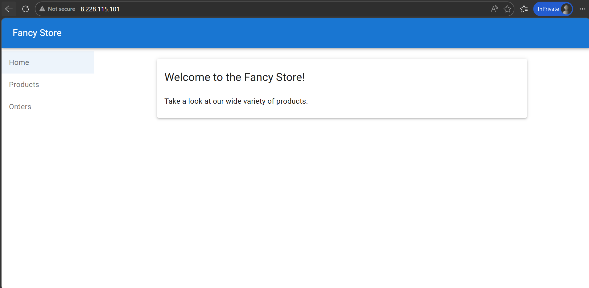
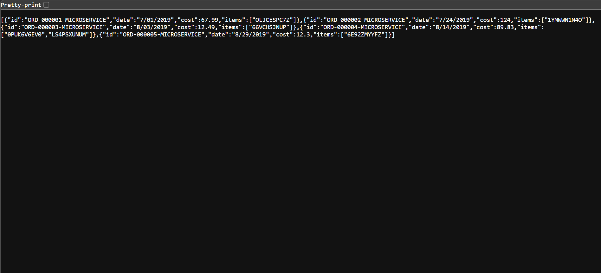
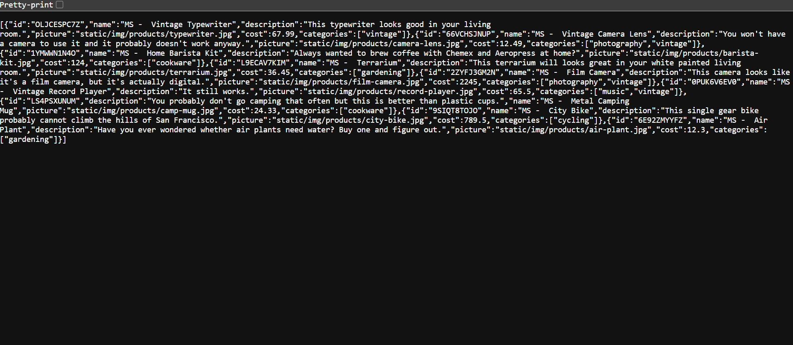
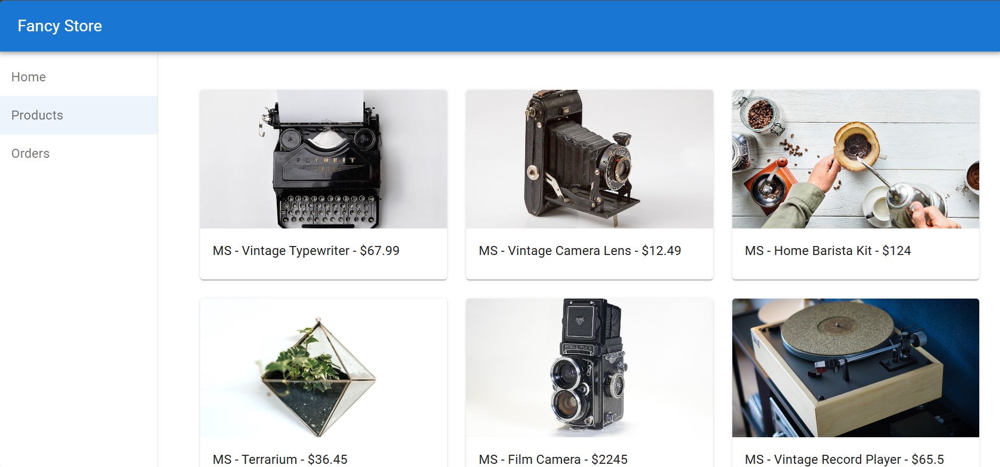
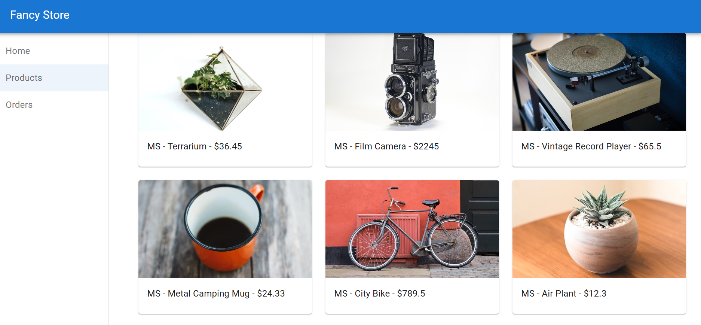
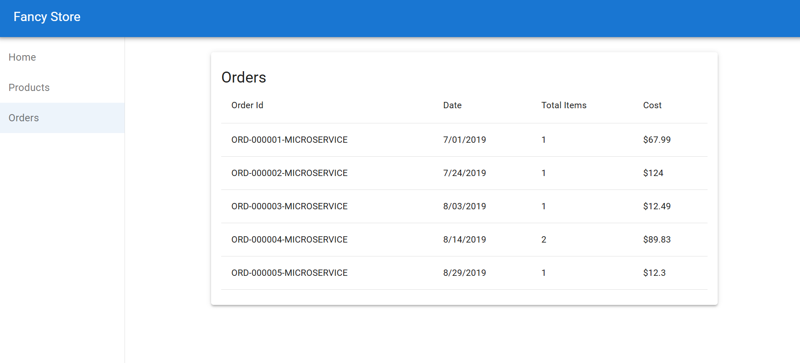

# FancyStore – Monolith to Microservices Challenge Lab

## Lab Scenario

You joined FancyStore, Inc. as a Cloud Engineer.

The company currently runs a monolithic e-commerce application. Your task is to migrate the application into microservices using Google Kubernetes Engine (GKE), Docker containers, and Google Cloud Build.

You are responsible for:

- Containerizing the monolith application
- Deploying it to Kubernetes
- Breaking services into microservices
- Deploying Orders, Products, and Frontend services separately
- Connecting all services together

---

# Global Objectives

## Infrastructure Objectives
- Create a Kubernetes cluster in `us-east4-c`
- Use cost-efficient `e2-medium` nodes
- Use 3 nodes in the cluster
- Deploy services using Kubernetes deployments
- Expose services publicly using LoadBalancers

---

## Containerization Objectives
- Build Docker images for:
  - Monolith
  - Orders service
  - Products service
  - Frontend service

- Push all container images to:
```text
gcr.io/$GOOGLE_CLOUD_PROJECT
```

---

## Application Objectives
- Verify monolith application works
- Separate application into:
  - Orders microservice
  - Products microservice
  - Frontend microservice

- Configure frontend to communicate with backend APIs

---

# Environment Information

| Item | Value |
|---|---|
| Project ID | `qwiklabs-gcp-02-dcfc016e9520` |
| Zone | `us-east4-c` |
| Cluster Name | `fancy-production-867` |
| Monolith Image | `fancy-monolith-307` |
| Orders Image | `fancy-orders-692` |
| Products Image | `fancy-products-347` |
| Frontend Image | `fancy-frontend-729` |

---

# Task 1 – Download Monolith Code and Build Container

## Objectives
- Clone source code repository
- Install dependencies
- Build monolith Docker container
- Push image to Google Container Registry

---

## Commands

### Set project
```bash
gcloud config set project qwiklabs-gcp-02-dcfc016e9520
```

### Clone repository
```bash
git clone https://github.com/GoogleCloudPlatform/monolith-to-microservices.git --depth=1
```

### Enter repository
```bash
cd monolith-to-microservices
```

### Run setup
```bash
./setup.sh
```

### Install latest Node.js
```bash
nvm install --lts
```

### Enter monolith directory
```bash
cd monolith
```

### Build monolith image
```bash
gcloud builds submit --tag gcr.io/$GOOGLE_CLOUD_PROJECT/fancy-monolith-307:1.0.0 .
```

---

## Expected Output
```text
DONE
SUCCESS
```

---

# Task 2 – Create Kubernetes Cluster and Deploy Monolith

## Objectives
- Create GKE cluster
- Deploy monolith application
- Expose application publicly
- Verify monolith website works

---

## Create cluster
```bash
gcloud container clusters create fancy-production-867 \
  --zone=us-east4-c \
  --num-nodes=3 \
  --machine-type=e2-medium
```

---

## Deploy monolith
```bash
kubectl create deployment fancy-monolith-307 \
  --image=gcr.io/$GOOGLE_CLOUD_PROJECT/fancy-monolith-307:1.0.0
```

---

## Expose deployment
```bash
kubectl expose deployment fancy-monolith-307 \
  --type=LoadBalancer \
  --port=80 \
  --target-port=8080
```

---

## Check services
```bash
kubectl get service
```

---

## Expected Output
```text
NAME                 TYPE           EXTERNAL-IP
fancy-monolith-307   LoadBalancer   <external-ip>
```

---

## Verification
Open:
```text
http://MONOLITH_EXTERNAL_IP
```

Expected:
- Fancy Store homepage loads successfully



---

# Task 3 – Create Orders and Products Microservices

## Objectives
- Build Orders microservice image
- Build Products microservice image
- Push images to Container Registry

---

# Orders Microservice

## Service Details

| Item | Value |
|---|---|
| Image | `fancy-orders-692` |
| Version | `1.0.0` |
| Path | `~/monolith-to-microservices/microservices/src/orders` |

---

## Build Orders Image

```bash
cd ~/monolith-to-microservices/microservices/src/orders
```

```bash
gcloud builds submit --tag gcr.io/$GOOGLE_CLOUD_PROJECT/fancy-orders-692:1.0.0 .
```

---

# Products Microservice

## Service Details

| Item | Value |
|---|---|
| Image | `fancy-products-347` |
| Version | `1.0.0` |
| Path | `~/monolith-to-microservices/microservices/src/products` |

---

## Build Products Image

```bash
cd ~/monolith-to-microservices/microservices/src/products
```

```bash
gcloud builds submit --tag gcr.io/$GOOGLE_CLOUD_PROJECT/fancy-products-347:1.0.0 .
```

---

## Expected Output
```text
DONE
SUCCESS
```

---

# Task 4 – Deploy Orders and Products Microservices

## Objectives
- Deploy Orders service
- Deploy Products service
- Expose both services publicly
- Verify APIs work correctly

---

# Orders Deployment

## Create deployment
```bash
kubectl create deployment fancy-orders-692 \
  --image=gcr.io/$GOOGLE_CLOUD_PROJECT/fancy-orders-692:1.0.0
```

## Expose deployment
```bash
kubectl expose deployment fancy-orders-692 \
  --type=LoadBalancer \
  --port=80 \
  --target-port=8081
```

---

# Products Deployment

## Create deployment
```bash
kubectl create deployment fancy-products-347 \
  --image=gcr.io/$GOOGLE_CLOUD_PROJECT/fancy-products-347:1.0.0
```

## Expose deployment
```bash
kubectl expose deployment fancy-products-347 \
  --type=LoadBalancer \
  --port=80 \
  --target-port=8082
```

---

## Check services
```bash
kubectl get service
```

---

## Example Output
```text
NAME                 TYPE           EXTERNAL-IP
fancy-orders-692     LoadBalancer   34.11.26.101
fancy-products-347   LoadBalancer   34.48.19.160
```




---

## API Verification

### Orders API
```text
http://34.11.26.101/api/orders
```

### Products API
```text
http://34.48.19.160/api/products
```

Expected:
- JSON responses returned successfully

---

# Task 5 – Configure Frontend Microservice

## Objectives
- Configure frontend to use Orders API
- Configure frontend to use Products API
- Rebuild frontend application

---

## Enter frontend app
```bash
cd ~/monolith-to-microservices/react-app
```

---

## Edit environment file
```bash
nano .env
```

---

## Replace contents
```env
REACT_APP_ORDERS_URL=http://34.11.26.101/api/orders
REACT_APP_PRODUCTS_URL=http://34.48.19.160/api/products
```

---

## Save nano
```text
CTRL+O
ENTER
CTRL+X
```

---

## Rebuild frontend
```bash
npm run build
```

---

## Expected Output
```text
Compiled successfully.
```

---

# Task 6 – Build Frontend Microservice Container

## Objectives
- Build frontend container image
- Push image to Container Registry

---

## Enter frontend service directory
```bash
cd ~/monolith-to-microservices/microservices/src/frontend
```

---

## Build frontend image
```bash
gcloud builds submit --tag gcr.io/$GOOGLE_CLOUD_PROJECT/fancy-frontend-729:1.0.0 .
```

---

## Expected Output
```text
DONE
SUCCESS
```

---

# Task 7 – Deploy Frontend Microservice

## Objectives
- Deploy frontend service
- Expose frontend publicly
- Verify frontend communicates with Orders and Products APIs

---

## Create deployment
```bash
kubectl create deployment fancy-frontend-729 \
  --image=gcr.io/$GOOGLE_CLOUD_PROJECT/fancy-frontend-729:1.0.0
```

---

## Expose deployment
```bash
kubectl expose deployment fancy-frontend-729 \
  --type=LoadBalancer \
  --port=80 \
  --target-port=8080
```

---

## Check services
```bash
kubectl get service
```

---

## Expected Output
```text
NAME                  TYPE           EXTERNAL-IP
fancy-frontend-729    LoadBalancer   <external-ip>
```

---

## Verification
Open:
```text
http://FRONTEND_EXTERNAL_IP
```

Expected:
- Fancy Store homepage works
- Orders page works
- Products page works






---

# Useful Kubernetes Commands

## View services
```bash
kubectl get service
```

## View deployments
```bash
kubectl get deployments
```

## View pods
```bash
kubectl get pods
```

## Delete deployment
```bash
kubectl delete deployment DEPLOYMENT_NAME
```

## Delete service
```bash
kubectl delete service SERVICE_NAME
```

---

# Final Architecture

```text
Frontend Microservice
        ↓
Orders Microservice
        ↓
Products Microservice
        ↓
Google Kubernetes Engine Cluster
```

---

# Container Images Summary

| Service | Image Name | Version |
|---|---|---|
| Monolith | fancy-monolith-307 | 1.0.0 |
| Orders | fancy-orders-692 | 1.0.0 |
| Products | fancy-products-347 | 1.0.0 |
| Frontend | fancy-frontend-729 | 1.0.0 |

---

# Ports Summary

| Service | Internal Port | External Port |
|---|---|---|
| Monolith | 8080 | 80 |
| Orders | 8081 | 80 |
| Products | 8082 | 80 |
| Frontend | 8080 | 80 |

---

## 🧑‍💻 Author  
- **LinkedIn**: [Aman Jha](https://www.linkedin.com/in/aman--jha/)  
- **GitHub**: [Aman Jha](https://github.com/jha-aman09) 
